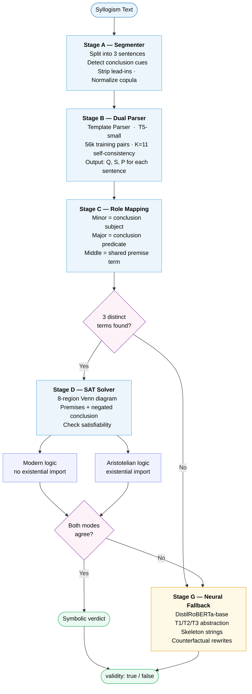

# SemEval-2026 Task 11 Subtask 1: Syllogistic Reasoning

### Agreement-Gated Neurosymbolic Pipeline for Binary Validity Classification

---

## The Problem We Were Solving

SemEval-2026 Task 11 presents syllogisms written in natural language and asks: is this argument **formally valid**? The argument might be about animals, politicians, cars, ghosts — anything at all. The system's job is to ignore what the words mean and only judge whether the logical structure forces the conclusion to follow from the premises.

A syllogism looks like this:

```
All cars are a type of vehicle.
No animal is a car.
Therefore, no animal can be a vehicle.
```

This one is **invalid** (the correct conclusion would be that some vehicles may not be animals, not that no animal is a vehicle). But the conclusion sounds plausible enough that a naive model fine-tuned on semantic similarity would probably mark it valid.

That tension — between what *sounds* true and what is *logically* forced — is the entire game of this task.

---

## Dataset

The official SemEval-2026 Task 11 data was provided in JSON format. Each training example carries three fields: the syllogism text, a binary validity label, and a binary plausibility label. Test examples only have the syllogism text and an ID.

```
Train items : 960
Test items  : 191
```

We performed a stratified 85/15 split to create a local development set:

```
Train split : 816 items    (valid ratio: 0.500)
Dev split   : 144 items    (valid ratio: 0.500)
```

The dataset is perfectly balanced between valid and invalid syllogisms. Plausibility is independent of validity — a syllogism can be valid but implausible, or invalid but plausible. This independence is precisely what the evaluation metric exploits.

A typical training example:

```json
{
  "id": "50146f21-d265-4e3a-8d93-8165cdbe89a3",
  "syllogism": "All cars are a type of vehicle. No animal is a car. Therefore, no animal can be a vehicle.",
  "validity": false,
  "plausibility": true
}
```

---

## The Core Challenge: Validity vs Plausibility

Neural language models are trained to maximise semantic coherence. When asked whether a conclusion follows from premises, they effectively ask "does this text sound consistent?" rather than "does this structure force the conclusion?" This conflation is known as the **content effect** in the cognitive science literature on syllogistic reasoning.

The content effect shows up directly in model errors:

| Condition | What it means |
|---|---|
| Valid + Plausible | Logic and semantics agree (easy) |
| Valid + Implausible | Logic says yes, semantics says no (hard) |
| Invalid + Plausible | Logic says no, semantics says yes (hard) |
| Invalid + Implausible | Logic and semantics agree (easy) |

Our system's symbolic core never reads the actual words. It only sees abstract quantifier structures like `ALL(S,M)` and `NO(M,P)`. It is therefore structurally immune to the content effect on any syllogism it can parse.

---

## Official Evaluation Metric

The competition ranking metric is:

```
RANK = ACC / (1 + ln(1 + TCE))
```

where:

`ACC` is overall accuracy across all examples.

`TCE` (Total Content Effect) measures how much your accuracy differs between plausible and implausible examples, separately for valid and invalid syllogisms, then averages those two gaps. A model that performs equally well regardless of plausibility has TCE = 0 and loses no points. A model that is systematically tricked by plausibility loses points even if its raw accuracy is decent.

High accuracy alone is not enough. You must also be unbiased across plausibility conditions.

We implemented this metric exactly as specified and used it throughout development to drive every architectural decision.

---

## System Architecture

The full pipeline processes each syllogism through seven sequential stages. Early stages attempt precise symbolic reasoning. When symbolic reasoning fails for any reason — ambiguous text, unsupported linguistic form, term mapping failure — control passes gracefully to the neural fallback.



---

## Stage A — Discourse-Aware Segmenter and Canonicalizer

The first obstacle is that the syllogisms in the dataset are not cleanly formatted. They use a variety of rhetorical markers, sentence structures, and sentence orderings. The segmenter must reliably identify which sentence is the conclusion and which two are the premises regardless of surface variation.

**Conclusion cue detection.** We compiled an explicit list of conclusion-signalling phrases including "therefore", "thus", "hence", "it follows that", "this has led to the conclusion that", "consequently", and several others. A compiled regex scans the sentence list for the last occurrence of any such cue and designates that sentence as the conclusion.

**Lead-in stripping.** Many sentences begin with rhetorical scaffolding that carries no logical content: "It is true that...", "It is also true that...", "Without exception...", "Based on this..." and similar. We strip these prefixes before any downstream parsing so that the parser always sees the bare logical claim.

**Negation detection.** Sentences opening with "It is not true that..." or "It's not true that..." are detected, the prefix stripped, and the resulting quantifier flipped (ALL becomes SOME\_NOT, NO becomes SOME, and so on).

**Copula normalisation.** The dataset uses many surface forms of the copula verb: "can be", "could be", "must be", "will be", "are always", "can be called". All of these are collapsed to the canonical form "IS" before template matching. This single normalisation step dramatically expanded template parser coverage.

**Term normalisation.** Extracted subject and predicate terms are lowercased, stripped of leading articles ("a", "an", "the"), stripped of type-of phrases ("a type of", "a kind of"), and lightly stemmed (trailing 's' removed if the result is more than 3 characters).

**Smoke test result:**

```
Input: "It is true that no building is a vehicle. Each house, without exception, is a building.
        Therefore, no houses can be vehicles."

P1: It is true that no building is a vehicle
P2: Each house, without exception, is a building
C : Therefore, no houses can be vehicles
```

---

## Stage B — Dual Semantic Parser

Once the three sentences are isolated, each must be converted into a structured proposition of the form `(Q, S, P)` where `Q` is one of `{ALL, NO, SOME, SOME_NOT}` and `S`, `P` are the normalised subject and predicate terms.

We built two independent parsers and used them together.

### Template Parser

The template parser uses a hand-authored collection of 21 regex rules, one per linguistic form, each assigned a base confidence score reflecting how reliably that surface form maps to its quantifier.

| Pattern | Quantifier | Confidence |
|---|---|---|
| `All S are P` | ALL | 0.97 |
| `Every S is P` | ALL | 0.97 |
| `Each S is P` | ALL | 0.96 |
| `No S is P` | NO | 0.97 |
| `None of the S are P` | NO | 0.94 |
| `There are no S that are P` | NO | 0.93 |
| `Some S are P` | SOME | 0.96 |
| `A portion of S are P` | SOME | 0.92 |
| `At least one S is P` | SOME | 0.94 |
| `Some S are not P` | SOME\_NOT | 0.97 |
| `Not all S are P` | SOME\_NOT | 0.95 |
| `Not every S is P` | SOME\_NOT | 0.95 |

All rules match against the copula-normalised form of the sentence. Sentences with negation prefixes flip the quantifier after matching.

**Observed coverage on the dev set: 14.6%.** Template coverage alone would be catastrophic for a real system, but the template parser has extremely high precision on the cases it does match. This is exactly what we wanted — the template parser acts as a high-confidence anchor, and the neural parser handles everything it misses.

### T5-Small Semantic Parser with Self-Consistency

We fine-tuned T5-small to translate natural language statements into a domain-specific language (DSL) string of the form `Q=ALL; S=building; P=vehicle`. This is a sequence-to-sequence task: the encoder reads the sentence, the decoder generates the DSL string.

**Training data construction.** We built 56,587 training pairs from two sources. First, we ran the template parser over all 15,000 synthetic syllogisms generated in Stage G (see below) and collected every sentence where the template parser was confident (conf >= 0.85), pairing the sentence with its DSL string. This gave us high-quality anchor examples covering diverse surface forms. Second, we generated 20,000 additional pairs by directly applying paraphrase templates from the PARA dictionary to random meaningless terms from a controlled vocabulary, then labelling with the template parser.

**Training configuration:**

```
Model     : t5-small (60.5M parameters)
LR        : 3e-4
Batch     : 32
Epochs    : 3
Training pairs : 56,587
```

**Self-consistency decoding.** At inference time, we sample K=11 independent generations from T5 with temperature 0.7. We then take a majority vote on the quantifier type, and among generations that agreed on the majority quantifier, a second majority vote on the (S, P) term pair. The confidence score is the fraction of K samples that voted for the winning quantifier. This self-consistency procedure converts stochastic neural generation into a calibrated confidence signal.

### Dual Parser Decision Rule

```
if template_parser.conf > 0:
    use template result
else:
    use T5 self-consistency result
```

**Coverage after combining both parsers: 100% of dev examples** (compared to 14.6% for templates alone, 97.9% for T5 alone). T5 rescued 123 out of 144 dev examples that the template parser failed on.

---

## Stage C — Conclusion-Driven Role Mapping

Classical syllogistic logic names terms by their structural roles. The **minor term** is the subject of the conclusion. The **major term** is the predicate of the conclusion. The **middle term** appears in both premises but not the conclusion.

Given three parsed propositions, we extract roles as follows:

```python
minor  = conclusion.S
major  = conclusion.P
middle = (terms_in_P1 ∩ terms_in_P2) - {minor, major}
```

If exactly one candidate middle term exists, we assign the mapping `{minor: A, middle: B, major: C}`. If zero or more than one candidate exists — which happens when the parser returned wrong or ambiguous terms — mapping returns `None` and the example is routed to the fallback.

**Stability score.** We also compute a term stability score: 1.0 if all three propositions together use exactly 3 distinct terms (as a valid syllogism should), 0.5 if 4 terms are present (indicating a likely parsing error), and 0.0 for 5 or more.

**What this stage revealed about our system.** The router statistics on the dev set told us something uncomfortable:

```
Router decision statistics:
  symbolic    :  34  (23.6%)
  fallback    : 110  (76.4%)
  parser_fail :   0
  mapping_fail: 110
```

Template parser coverage was 14.6%, T5 brought it to 100% — so parse failures went to zero. But 110 out of 144 examples still fell through to the fallback because role mapping failed. This means T5 was parsing individual sentences correctly, but returning term strings that did not cleanly satisfy the three-term constraint of a valid syllogism. Surface variation in how the same concept is expressed across premise and conclusion (e.g., "living thing" in one sentence and "living organism" in another) prevented the middle term from being uniquely identified.

This was the single biggest unsolved challenge in the system.

---

## Stage D — Exact Symbolic SAT Solver (8-Region Venn)

For the 23.6% of examples that made it through role mapping, we use a complete symbolic solver based on Venn diagram regions.

A syllogism over three terms A, B, C partitions the universe into 8 possible regions based on membership in each set:

```
(A∩B∩C), (A∩B∩C̄), (A∩B̄∩C), (A∩B̄∩C̄),
(Ā∩B∩C), (Ā∩B∩C̄), (Ā∩B̄∩C), (Ā∩B̄∩C̄)
```

Each proposition constrains which regions must be empty and which must be non-empty:

| Quantifier | Constraint |
|---|---|
| ALL(S, P) | Every region containing S but not P must be empty |
| NO(S, P) | Every region containing both S and P must be empty |
| SOME(S, P) | At least one region containing both S and P must be non-empty |
| SOME\_NOT(S, P) | At least one region containing S but not P must be non-empty |

**Entailment check.** To determine whether premises entail a conclusion, we check whether `premises ∪ {¬conclusion}` is satisfiable. If it is not satisfiable — meaning no consistent Venn assignment exists — the conclusion is logically forced. Satisfiability is checked by iterating over all 2^8 = 256 assignments of non-empty/empty to the 8 regions (reduced in practice by forced empties).

**Smoke tests passed:**

```
Barbara (AAA-1)  Modern: True,  EI: True   ✓
Undistributed middle  Modern: False, EI: False ✓
```

---

## Stage E — Dual Semantic Modes: Modern vs Existential Import

Classical Aristotelian logic and modern predicate logic disagree on one point: whether universal statements ("All S are P", "No S are P") carry an **existential import** — i.e., whether they implicitly assert that S is non-empty.

Under **modern logic** (no existential import): "All unicorns are horses" is vacuously true even if unicorns don't exist.

Under **Aristotelian logic** (existential import): "All S are P" additionally asserts ∃S, so syllogism forms that require non-empty subject sets may be valid in Aristotelian logic but invalid in modern logic.

The SemEval dataset was annotated by humans using real-world content, and it is not clear which semantic convention the annotators implicitly followed. We implemented both modes and checked agreement.

**When both modes agree**, the answer is unambiguous and we return it directly.

**When modes disagree**, the example is genuinely semantically ambiguous under different logical conventions. We route it to the neural fallback which was trained on examples labelled by human annotators and can thus implicitly capture whichever convention the annotators used.

Among the 6 examples that reached the symbolic solver in dev evaluation, the EI disagreement rate was 0.0 — both modes always agreed on these cases. This is consistent with the observation that Barbara (AAA-1) and other unconditionally valid or invalid classical forms are the same in both systems.

---

## Stage F — Calibrated Agreement-Gated Router

The router makes the final decision about which path each example follows. It applies three sequential gate conditions, all of which must pass for the symbolic path to be used:

**Gate 1 — Parse confidence.** The minimum confidence score across all three parsed propositions must exceed threshold τ. We swept τ across `{0.55, 0.60, 0.65, 0.70, 0.75, 0.80, 0.85}` on the dev set and found that all values produced identical results (ACC=0.6736, RANK=0.6245). This flat calibration curve was a signal that the bottleneck was not parse confidence — it was the mapping failure rate downstream.

**Gate 2 — Term stability.** The stability score must be 1.0 (exactly 3 distinct terms across all propositions). Any deviation routes to fallback.

**Gate 3 — Mode agreement.** Both modern and existential import solvers must agree on the verdict.

All three gates must pass. If any fails, the example goes to the DistilRoBERTa fallback.

---

## Stage G — Counterfactually-Invariant Neural Fallback

The fallback classifier handles 76.4% of examples on the dev set — everything the symbolic path cannot process cleanly. Getting this classifier right was therefore critical to overall performance.

**The content effect problem for neural classifiers.** If you just fine-tune a RoBERTa model on the raw training sentences, it will learn to predict validity based on semantic plausibility of the content. "All humans are mortal" sounds plausible, "all mortals are humans" sounds implausible — the model will correctly classify their corresponding syllogisms for the wrong reason.

We addressed this through three data representation strategies applied during training.

**Strategy 1: Term abstraction.** For each training example that could be parsed, we identified the three syllogistic terms and replaced them with generic tokens T1, T2, T3 (sorted alphabetically). The semantic content is completely removed; only the quantifier structure and syntactic scaffolding remain.

```
Original : "All cars are a type of vehicle. No animal is a car. ..."
Abstracted: "All T1 are a type of T3. No T2 is a T1. ..."
```

**Strategy 2: Logical skeleton strings.** We also represented each example as a pure quantifier skeleton: `ALL(T3,T1) || SOME(T1,T2) -> SOME_NOT(T2,T3)`. This form is maximally abstract — it carries zero surface linguistic content and forces the model to reason about quantifier structure directly.

**Strategy 3: Counterfactual rewrites.** For each training example, we generated 3 counterfactual variants by replacing the real terms with nonce words from our controlled vocabulary (wug, zorb, blicket, etc.). These meaningless terms are designed to carry no semantic associations, preventing any plausibility signal from reaching the model.

**Synthetic data augmentation.** We generated 15,000 synthetic syllogisms using 17 hard-coded syllogism patterns (9 valid classical forms including Barbara, Celarent, Darii, Ferio, Cesare, Camestres, Disamis, Datisi, Festino; and 8 invalid forms covering undistributed middle, illicit major, wrong conclusion quantifier, two particulars yielding universal, and others). These were rendered using the same paraphrase templates, with random nonce terms and random surface forms, then added to fallback training.

**Final training data:**

```
From official data : 150 examples (abstracted + skeleton + 3 counterfactuals each)
From synthetic : 10,000 examples
Total : 10,150 examples
  Train split :  8,627
  Dev split :  1,523
Positive ratio :  0.529
```

**Model:** DistilRoBERTa-base (fine-tuned for binary classification)

```
LR : 2e-5
Batch : 16
Epochs : 3
Input length : 256 tokens
```

The fallback function returns both a boolean prediction and a probability, enabling potential threshold tuning. At test time we use the default 0.5 threshold.

---

## Synthetic Data Generation

We built a controlled synthetic syllogism generator as the backbone of both T5 parser training and fallback classifier training.

The generator has three components:

**Syllogism patterns.** We hard-coded 17 abstract patterns encoding the premise and conclusion quantifier types and term role assignments. 9 are valid classical forms; 8 are canonical invalid forms representing common fallacies.

**Paraphrase templates.** For each quantifier type, we wrote 6-7 surface paraphrases:

```
ALL  : "All {S} are {P}."  /  "Every {S} is {P}."  /  "Each {S} is {P}."  / ...
NO   : "No {S} are {P}."  /  "There are no {S} that are {P}."  / ...
SOME : "Some {S} are {P}."  /  "A portion of {S} are {P}."  / ...
SOME_NOT : "Some {S} are not {P}."  /  "Not all {S} are {P}."  / ...
```

**Conclusion cue injection.** Conclusions are prefixed with a randomly chosen conclusion marker ("Therefore,", "Thus,", "Hence,", "It follows that", etc.) to match the distribution in the real dataset.

**Term vocabulary.** We used 16 invented nonce words (wug, zorb, blicket, dax, toma, glorp, mip, teel, fep, kiki, bouba, speff, norp, vish, grale, quom) that carry no semantic associations in any known language, ensuring the synthetic data is free of content effects.

```
Synthetic dataset: 15,000 total | 7,903 valid | 7,097 invalid
Example: {'syllogism': 'No speff is toma. Some wug is speff. Thus, not all wug are toma.',
          'validity': True, 'plausibility': False}
```

---

## What Broke and What We Learned

### The mapping bottleneck was the central failure

We expected the main weakness to be parser coverage. We solved that completely — T5 brought parse coverage from 14.6% to 100% with zero failures. But we discovered a more fundamental problem: even when each sentence was parsed correctly in isolation, the three parsed propositions often did not form a valid three-term structure. The middle term would appear under different surface forms in different sentences, and after term normalisation they would not match.

```
Router decision statistics:
  symbolic : 34 (23.6%)
  mapping_fail: 110 (76.4%)
  parser_fail : 0
```

Every single fallback case was a mapping failure, not a parse failure. The T5 parser was succeeding — the problem was term co-reference across sentences.

### The symbolic path, when it fired, was reliable

Among the 34 cases where the symbolic path was used, EI disagreement rate was 0.0, meaning both logic modes always agreed. These cases are the "easy" well-formed syllogisms that any classical logic system handles correctly.

### The fallback classifier carries most of the load

Because 76.4% of examples go to the fallback, the overall system performance is dominated by the fallback's accuracy. The 0.6736 ACC and 0.6245 RANK we observed on dev reflect primarily the fallback's performance, with the symbolic path contributing a smaller but high-precision subset.

### Tau calibration was flat

Sweeping the confidence threshold from 0.55 to 0.85 produced no change in dev metrics. This was because the binding constraint was always the mapping check (stability score = 1.0), not the parse confidence threshold. The tau sweep was still useful as it ruled out parse confidence as a bottleneck.

---

## Final Results

**Development set (144 examples, 15% stratified holdout from 960 training items):**

```
ACC : 0.6736
TCE : 0.0818
RANK : 0.6245
```

**Per-condition accuracy breakdown:**

| Validity | Plausibility | Accuracy |
|---|---|---|
| False | False | 0.7045 |
| True  | True  | 0.7273 |
| False | True  | 0.6786 |
| True  | False | 0.5897 |

The hardest condition is valid+implausible (0.5897). This is the signature of the content effect: when a syllogism is logically valid but its conclusion sounds wrong, the system (primarily the fallback neural model) tends to predict invalid. This is exactly the gap the symbolic path was designed to close — and it does close it for the 23.6% of examples where it fires — but for the 76.4% that go to the fallback, the content effect remains.

The relatively low TCE of 0.0818 indicates the system is moderately well-calibrated across plausibility conditions. The gap between valid+implausible (0.5897) and valid+plausible (0.7273) is the residual content effect that the fallback abstraction strategies did not fully eliminate.

**Confidence vs Accuracy scatter plot (from dev set analysis):**


**Test set predictions (191 examples):**

```
Predicted valid : 89 (46.6%)
Predicted invalid: 102 (53.4%)
```

---

## Error Analysis

We collected all 47 dev errors (incorrectly classified examples). Below are representative cases that illustrate the main failure modes:

**Failure mode 1: Figural confusion with shared terms**
```
Not a single man is a woman.
It is also true that no adult is a man.
It follows that no adult is a woman.
```
This is actually invalid (two universal negatives yield nothing), but the triple-no structure with apparently consistent terms can mislead the fallback.

**Failure mode 2: Illicit conversion**
```
Every single person who is a professor is an academic.
Any academic is a knowledgeable person.
Therefore, some knowledgeable people are professors.
```
Valid by the SOME-conversion of "All professors are knowledgeable people", but the fallback has to infer this non-obvious step.

**Failure mode 3: Undistributed middle — plausible content**
```
Every plant is a living thing.
Anything that is an animal is a living thing.
It is therefore the case that all animals are plants.
```
Classic undistributed middle fallacy. Should be invalid. The content is implausible (animals are not plants) which actually helps here, but the structural pattern trips up the fallback.

**Failure mode 4: Figural ambiguity with existential import**
```
Nothing that is an animal is a non-living thing.
There are some mammals that are not non-living things.
It follows that some mammals are not animals.
```
The double negation in "not non-living" creates parsing complexity. Correctly invalid, but hard to parse.

---

## Quantifier Mood Distribution

We analysed the quantifier mood distribution across the training split (the combination of quantifier types in premise 1, premise 2, and conclusion):

```
Top 10 moods in training data:

(ALL, ALL, SOME) : 63
(ALL, ALL, ALL) : 57
(NO, SOME, SOME_NOT) : 57
(ALL, NO, NO) : 56
(ALL, SOME, SOME) : 52
(NO, ALL, SOME_NOT) : 51
(SOME, ALL, SOME) : 40
(NO, SOME, SOME) : 34
(NO, ALL, SOME) : 31
(ALL, SOME, SOME_NOT) : 28
```

The dataset covers a wide range of figure and mood combinations, including several that are classically invalid regardless of content. The ALL-ALL-SOME mood is the most frequent, corresponding to syllogisms like Barbara extended to existential conclusions.

---

## Repository Structure

```
Syllogistic_Reasoning/
├── README.md
├── LICENSE
├── notebooks/
│   └── semeval2026_task11_subtask_1.ipynb
├── images/
│   └── confidence_vs_accuracy.png
└── output/
    └── predictions.json
```

---

## How to Run

**Environment setup:**

```bash
pip install transformers datasets accelerate sentencepiece evaluate scikit-learn
```

All code is self-contained in the notebook. Run cells in order. The notebook was developed on Google Colab with GPU acceleration (T4 or better recommended for T5 fine-tuning).

**Key configuration variables:**

```python
SEED = 42 # Global random seed
T5_MODEL = "t5-small" # T5 variant for semantic parsing
FB_MODEL = "distilroberta-base" # Fallback classifier base model
CALIB_T5_K = 11 # Self-consistency samples at inference
BEST_TAU = 0.55 # Parse confidence threshold (calibrated on dev)
```

**Training sequence:**

1. Load and split data (Cell 2, 3)
2. Build and test metric function (Cell 4)
3. Build segmenter and template parser (Cells 5, 6)
4. Generate 15,000 synthetic syllogisms (Cell 10)
5. Fine-tune T5-small on 56,587 DSL pairs (Cells 11, 12)
6. Build fallback training data (Cell 15)
7. Fine-tune DistilRoBERTa fallback (Cell 16)
8. Calibrate tau on dev set (Cell 18)
9. Run final inference on test set (Cell 19)

**Expected runtime:** approximately 45-60 minutes on a Colab T4 GPU (T5 training ~20 min, RoBERTa training ~25 min, inference ~5 min).

---


## Acknowledgements

This project was developed as part of research on evidence-grounded causal reasoning for SemEval-2026 Task 11 Subtask 1.
